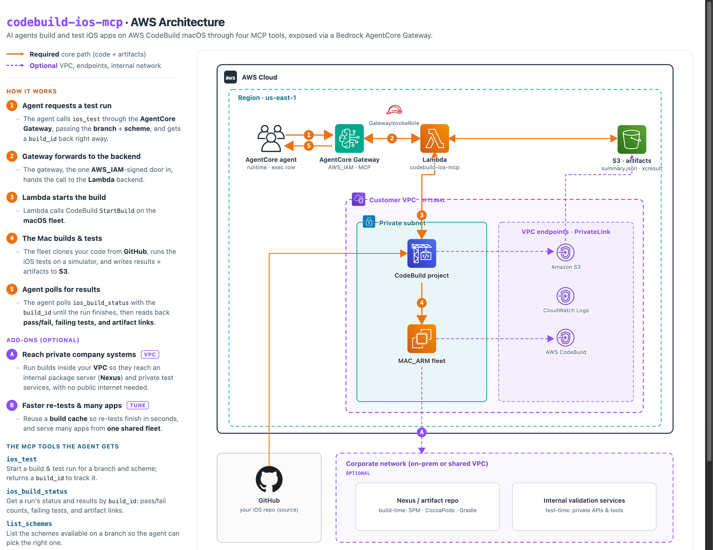

# codebuild-ios-mcp

An AWS CodeBuild macOS (`MAC_ARM`) iOS build + test runner exposed to AI agents
as MCP tools through an Amazon Bedrock AgentCore Gateway.

An agent calls `ios_test(branch, scheme)`, polls `ios_build_status(build_id)`,
and gets back a structured pass/fail summary, per-test failures, presigned S3
artifact URLs (xcresult zip + screenshots), and a CloudWatch Logs link. Two more
tools round it out: `list_schemes` and `get_test_logs`. The design is async:
`ios_test` starts the build and returns a `build_id` immediately, so every tool
call stays well under Lambda/Gateway timeouts regardless of build duration.

This repo is the **CDK v2 (TypeScript)** packaging of that system: one
`cdk deploy` provisions everything CloudFormation can model, and one CLI script
(`scripts/register-gateway.sh`) finishes the AgentCore Gateway wiring.

---

## Architecture



> Interactive source: [`docs/architecture.html`](docs/architecture.html). Solid orange
> is the required core path (including code + artifact movement); dashed purple is the
> optional VPC / private-network add-on.

What `cdk deploy` creates:

- **S3 artifacts bucket** `ios-agent-test-artifacts-<account>` — all public access
  blocked, SSE-S3 encryption, SSL enforced, `builds/` expires after 14 days, and
  seeded with `tooling/xcresult_to_junit.py` (used by the buildspec to convert
  `.xcresult` to JUnit XML).
- **MAC_ARM reserved CodeBuild fleet** — `BUILD_GENERAL1_MEDIUM`, image
  `aws/codebuild/macos-arm-base:14`, baseCapacity 1, overflow `QUEUE`. Modeled
  with `AWS::CodeBuild::Fleet` (`CfnFleet`) because no L2/L1 construct exists.
- **CodeBuild project** `ios-agent-tests` — GITHUB source (your iOS repo), the
  buildspec embedded **inline** from `buildspec.yaml`, attached to the fleet,
  40-minute timeout, dedicated CloudWatch log group, auto-creates the
  `ios-agent-tests-ios-test-report` JUNITXML report group on first run.
- **Lambda** `codebuild-ios-mcp` — the four MCP tools, least-privilege exec role.
- **Gateway invoke role** + a Lambda resource permission for the
  `bedrock-agentcore.amazonaws.com` principal, so the Gateway can invoke the
  Lambda once registered.

What `cdk deploy` does **not** create: the AgentCore Gateway and its target.
There is no CloudFormation/CDK resource for them yet, so
`scripts/register-gateway.sh` creates them via the CLI from the stack outputs.
This is a one-time step.

---

## Cost warning (read this first)

> **A `MAC_ARM` reserved fleet bills continuously, whether or not a build is
> running.** Reserved macOS capacity is roughly **$25-30/day per instance**, and
> Apple licensing imposes a **~24-hour minimum lease** per dedicated host, so you
> are billed for at least a full day even if you delete the fleet minutes after
> creating it. With `baseCapacity: 1` you have one always-on instance.
>
> Treat this stack as something you stand up, use, and **tear down** — not leave
> running idle. See [Teardown](#teardown). On-demand (`ON_DEMAND`) overflow is not
> available for `MAC_ARM`, which is why the fleet uses `QUEUE`; you cannot avoid
> the reserved-capacity model for macOS builds.

---

## Prerequisites

- An AWS account, and credentials in your shell (`aws sts get-caller-identity`
  should succeed). `MAC_ARM` is only available in **us-east-1, us-east-2,
  us-west-2, eu-central-1, ap-southeast-2** — deploy into one of these.
- **Node.js 18+** and npm.
- **AWS CDK v2** (`npm i -g aws-cdk`, or use the local dev dependency).
- **AWS CLI v2** with the `bedrock-agentcore-control` service (for the gateway
  scripts) and **`jq`**.
- If your iOS repo is **private**, import a GitHub source credential once per
  account/region so CodeBuild can clone it:

  ```bash
  aws codebuild import-source-credentials \
    --server-type GITHUB \
    --auth-type PERSONAL_ACCESS_TOKEN \
    --token <your-github-pat>
  ```

---

## Configuration

Defaults live in `cdk.json` under the `context` block; override any of them with
`-c key=value` at deploy time. Account and region come from your AWS profile
(`CDK_DEFAULT_ACCOUNT` / `CDK_DEFAULT_REGION`) — nothing is hardcoded.

| Context key                              | Default                                                         | Purpose                                            |
| ---------------------------------------- | --------------------------------------------------------------- | -------------------------------------------------- |
| `codebuild-ios-mcp:githubRepo`           | `https://github.com/aws-samples/aws-mobile-ios-notes-tutorial`  | GITHUB source the project builds and tests         |
| `codebuild-ios-mcp:sourceVersion`        | `main`                                                          | Default branch/SHA the project checks out          |
| `codebuild-ios-mcp:projectDir`           | `.`                                                            | Subdir holding the `.xcworkspace`/`.xcodeproj`     |
| `codebuild-ios-mcp:defaultDevice`        | `iPhone 17`                                                     | Default simulator device name                      |
| `codebuild-ios-mcp:artifactRetentionDays`| `14`                                                           | Days before `builds/` artifacts expire             |
| `codebuild-ios-mcp:presignTtlSec`        | `3600`                                                         | TTL (seconds) for presigned artifact URLs          |
| `codebuild-ios-mcp:vpcId`                | `""` (no VPC)                                                  | VPC to run builds in (reach private Nexus/services) |
| `codebuild-ios-mcp:subnetIds`            | `""`                                                          | Comma-separated subnet ids for the fleet            |
| `codebuild-ios-mcp:securityGroupIds`     | `""`                                                          | Comma-separated security group ids for the fleet    |
| `codebuild-ios-mcp:createVpcEndpoints`   | `true`                                                        | When in a VPC, auto-create S3/Logs/CodeBuild endpoints (set `false` if you have a NAT) |
| `codebuild-ios-mcp:cacheMode`            | `none`                                                        | Build cache: `none` / `local` / `s3` — speeds the fix→retest loop |

See [Connect builds to your private network](#connect-builds-to-your-private-network-nexus-internal-services)
for the VPC keys.

---

## Deploy

```bash
npm install
npx cdk bootstrap                       # once per account/region
npx cdk deploy \
  -c codebuild-ios-mcp:githubRepo=https://github.com/<you>/<your-ios-app> \
  -c codebuild-ios-mcp:projectDir=ios   # if the Xcode project lives in a subdir

# Then register the AgentCore Gateway + lambda target from the stack outputs:
./scripts/register-gateway.sh
```

`register-gateway.sh` prints the `GATEWAY_ID`, `GATEWAY_ARN`, `GATEWAY_URL`, and
`TARGET_ID`. Agents connect to `GATEWAY_URL` over MCP using SigV4 (`AWS_IAM`).

### Reuse an existing gateway (one gateway, many targets)

By default the script creates a dedicated gateway. If you already run an
AgentCore Gateway and want an agent to see these iOS tools alongside its other
tools at a single MCP URL, register this stack's Lambda as a target on that
gateway instead:

```bash
EXISTING_GATEWAY_ID=<your-gateway-id> ./scripts/register-gateway.sh
```

It skips `create-gateway` and adds only the lambda target. One caveat: gateway
targets invoke the Lambda with the **gateway's own** `GATEWAY_IAM_ROLE`, so this
stack's `GatewayInvokeRole` is bypassed — grant the existing gateway's role
`lambda:InvokeFunction` on the `LambdaArn` the script prints, or calls fail with
`AccessDenied`. To remove just this target later (leaving the shared gateway and
any sibling targets intact):

```bash
KEEP_GATEWAY=1 TARGET_ID=<target-id> GATEWAY_ID=<gateway-id> ./scripts/deregister-gateway.sh
```

---

## How an agent uses it

The Gateway exposes the four tools defined in `gateway-tools.json`. The contract
is async — start a build, then poll:

1. `ios_test(branch, scheme, [device], [os_version], [test_plan])`
   → returns `{ status: "IN_PROGRESS", build_id }` immediately.
2. Poll `ios_build_status(build_id)` until `status != "IN_PROGRESS"`.
   - `SUCCEEDED` — all tests passed.
   - `FAILED` — tests ran and some failed (`test_summary`, `failures[]`).
   - `BUILD_ERROR` — compile/build failed before tests ran (`test_summary.total == 0`).
   - `TIMED_OUT` — build exceeded the 40-minute limit.
   - Completed results include presigned `artifacts.xcresult_url`,
     `artifacts.screenshots[]`, and a `artifacts.logs_url` CloudWatch link.
3. `list_schemes(branch)` — schemes the buildspec published for that branch
   (written to `schemes/<branch>.json` on each run).
4. `get_test_logs(build_id, test_name)` — class name, message, duration, and
   failure screenshots for one failed test.

Poll loop sketch:

```text
id = ios_test(branch="feature/x", scheme="MyApp")["build_id"]
loop:
    r = ios_build_status(id)
    if r["status"] == "IN_PROGRESS": sleep 20s; continue
    break
# r now has test_summary, failures[], artifacts{}
```

### Connect an agent to the Gateway

The Gateway uses `AWS_IAM` auth, so any caller with AWS credentials and
`bedrock-agentcore:InvokeGateway` reaches the tools over MCP via SigV4 — no
Cognito, no client secret. The `GATEWAY_URL` is printed by
`scripts/register-gateway.sh` (re-print anytime with
`aws bedrock-agentcore-control get-gateway --gateway-identifier <id>`).

A complete, copy-paste client is in
[`examples/connect_agent.py`](./examples/connect_agent.py) — a SigV4 httpx auth
class wired into the MCP streamable-HTTP transport and handed to a Strands Agent.

```bash
export GATEWAY_URL="https://<gateway-id>.gateway.bedrock-agentcore.<region>.amazonaws.com/mcp"
python examples/connect_agent.py --list   # auth + tool-discovery smoke test (no model needed)
python examples/connect_agent.py          # run an agent that drives a test build
```

### Test it locally from a desktop MCP client (Claude Code, Cursor, Q CLI)

Want to poke at the tools from your laptop instead of a cloud agent? Desktop MCP
clients speak MCP but their HTTP transport only sends **static headers**, so they
can't SigV4-sign, and the gateway is `AWS_IAM`-gated. Bridge the gap with AWS
Labs' [`mcp-proxy-for-aws`](https://github.com/awslabs/mcp-proxy-for-aws) (MIT,
`uvx`-installable): a local stdio↔HTTP proxy that signs each call with your AWS
credentials and forwards to the gateway. The client talks plain stdio to the
proxy; the proxy does the auth.

`register-gateway.sh` prints a ready-to-paste block with your real `GATEWAY_URL`
and region filled in. It looks like this:

```jsonc
// ~/.claude.json  (or .mcp.json / Cursor / Amazon Q CLI mcp config)
"mcpServers": {
  "codebuild-ios": {
    "command": "uvx",
    "args": ["mcp-proxy-for-aws@latest",
             "<GATEWAY_URL>",
             "--service", "bedrock-agentcore",
             "--region", "<REGION>"],
    "env": { "AWS_PROFILE": "<your-profile>" }
  }
}
```

Three things that bite if you skip them:

- **Signing proxy is required.** Desktop MCP clients can't SigV4-sign natively;
  `mcp-proxy-for-aws` is the bridge. Don't paste `GATEWAY_URL` straight into a
  client config — it will 403.
- **Profile / account.** The proxy signs with whatever the AWS credential chain
  resolves to. Pin `AWS_PROFILE` to a profile in the **gateway's account/region**,
  or you'll sign as the wrong principal and get `AccessDenied`.
- **It's IAM-gated.** That principal needs `bedrock-agentcore:InvokeGateway` on
  the gateway ARN (the same grant the AgentCore Runtime role gets, below).

### AgentCore Runtime agents (the intended consumer)

Nothing extra to wire. The runtime already executes under an IAM **execution
role**, and botocore signs requests with those ambient credentials — no Cognito,
no token vault, no client secret. Two requirements:

1. Grant the runtime's execution role permission to invoke the gateway:

   ```json
   { "Effect": "Allow",
     "Action": "bedrock-agentcore:InvokeGateway",
     "Resource": "<GatewayArn from register-gateway.sh>" }
   ```

2. Point the agent at `GATEWAY_URL` using the transport in
   `examples/connect_agent.py`. The four tools auto-discover via `tools/list`.

For interactive testing, point the
[MCP Inspector](https://modelcontextprotocol.io/) at `GATEWAY_URL` with a SigV4
`Authorization` header. The Lambda also accepts direct invocation for smoke tests:
`aws lambda invoke --function-name codebuild-ios-mcp --payload '{"tool":"list_schemes","arguments":{"branch":"main"}}' out.json`.

---

## Point it at your own iOS repo

1. Set `codebuild-ios-mcp:githubRepo` to your repo and (if needed)
   `codebuild-ios-mcp:projectDir` to the subdir holding the
   `.xcworkspace`/`.xcodeproj`.
2. For private repos, import a GitHub source credential (see Prerequisites).
3. `cdk deploy`. Your repo needs **no buildspec file** — it is embedded in the
   project from this repo's `buildspec.yaml`.

The buildspec auto-detects the workspace/project, resolves a concrete simulator
by device id, runs `xcodebuild test`, uploads a screenshot and
`TestResults.xcresult.zip` to S3 under `builds/$CODEBUILD_BUILD_ID/`, and parses
the xcresult into `builds/$CODEBUILD_BUILD_ID/summary.json` — the authoritative
source for the structured `test_summary` / `failures` the tools return.

### Connect builds to your private network (Nexus, internal services)

By default the fleet has public egress only. To run builds inside your VPC — so
they can pull from an internal Nexus/artifact repo and hit internal validation
services during tests — set three optional context values at deploy time:

```bash
cdk deploy \
  -c codebuild-ios-mcp:githubRepo=https://github.com/you/app \
  -c codebuild-ios-mcp:projectDir=ios \
  -c codebuild-ios-mcp:vpcId=vpc-0abc123 \
  -c codebuild-ios-mcp:subnetIds=subnet-aaa,subnet-bbb \
  -c codebuild-ios-mcp:securityGroupIds=sg-xyz
```

When set, the fleet attaches to the VPC and gets a fleet service role with the
ENI permissions CodeBuild needs. Leave them empty for the default (no VPC).

**Private (no-NAT) subnets are supported out of the box.** A build inside a VPC
can reach your private hosts but, without a path to AWS, loses CloudWatch log
streaming and S3 artifact upload. So when VPC mode is on, the stack also creates
the three endpoints a private subnet needs — an **S3 gateway endpoint** plus
**CloudWatch Logs** and **CodeBuild** interface endpoints (PrivateLink) — with a
security group that allows HTTPS from your build SGs. No NAT gateway required.

If your VPC already has a NAT gateway (or those endpoints), skip them:

```bash
cdk deploy ... -c codebuild-ios-mcp:createVpcEndpoints=false
```

The subnets still must route to your internal resources (Nexus, validation
services) via your own NAT/Transit Gateway/peering. Nothing else changes — the
same four MCP tools work whether or not the fleet is in a VPC.

### Speed up the fix → retest loop (build cache)

Every build is cold by default. For the tight agent loop (fix → push → retest),
enable a cache so only changed files recompile — set `cacheMode`:

| `cacheMode` | What it does | Best for |
| ----------- | ------------ | -------- |
| `none` (default) | Every build clones + compiles from scratch | one-off runs |
| `local` | DerivedData + source stay warm on the reserved Mac (fastest; no upload/download) | one shared project building many apps |
| `s3` | Cache stored durably in the artifacts bucket under `cache/`; survives instance replacement | one-project-per-app, or when you need the cache to outlive the fleet |

```bash
cdk deploy ... -c codebuild-ios-mcp:cacheMode=local
```

First build is still cold; subsequent builds reuse DerivedData/SPM and finish in
a fraction of the time. The cache paths live in `buildspec.yaml`'s `cache:` block.

### Many apps on one stack

The fleet is the only standing cost — **always run one shared fleet**, never one
per app. Two ways to serve multiple apps on it:

- **One shared project (simplest).** Pass `repo` (and `project_dir`) to `ios_test`
  per call; the shared project points at that GitHub repo for the run. Zero
  per-app setup — add an app by aiming the tool at its repo. Pair with
  `cacheMode=local`.
- **One project per app.** Deploy the stack once per app (distinct `githubRepo`)
  for isolated build history, logs, metrics, and an isolated `s3` cache prefix.
  The enterprise shape (e.g. a large app with strict separation). Pair with
  `cacheMode=s3`.

Either way the Gateway, Lambda, and tools are unchanged.

### The buildspec is the single source of truth

`buildspec.yaml` at the repo root is read at synth time and embedded inline into
the CodeBuild project. To change build behavior, edit that **one file** and
`cdk deploy` again — there is no buildspec to maintain in the iOS repo. The
`ios_test` env overrides (`SCHEME`, `DEVICE`, `OS_VERSION`, `TEST_PLAN`) and the
project env (`ARTIFACTS_BUCKET`, `PROJECT_DIR`) are the contract between the
Lambda and the buildspec — keep them in sync if you change either side.

---

## Teardown

Order matters: delete the Gateway first (it is not part of the stack), then the
CDK stack. Deleting the stack deletes the `MAC_ARM` fleet, which stops fleet
billing (subject to the ~24-hour minimum lease).

```bash
# 1. Delete the AgentCore Gateway target(s) + gateway.
GATEWAY_NAME=codebuild-ios-mcp-gw ./scripts/deregister-gateway.sh

# 2. Delete everything the stack created (fleet, project, Lambda, bucket, roles).
npx cdk destroy
```

The artifacts bucket is created with `RemovalPolicy.DESTROY` + auto-delete so
`cdk destroy` removes it cleanly. If you want to retain artifacts in production,
change the bucket's removal policy to `RETAIN` in
`lib/codebuild-ios-mcp-stack.ts` before deploying.

If `cdk destroy` ever leaves the fleet behind (e.g. a build was running), delete
it manually:

```bash
aws codebuild delete-fleet --arn <FleetArn-from-outputs>
```

---

## Repository layout

```
.
├── bin/app.ts                       CDK app entrypoint; reads context, instantiates the stack
├── lib/codebuild-ios-mcp-stack.ts   the stack (bucket, fleet, project, Lambda, gateway role, outputs)
├── lambda/handler.py                the four MCP tools (Gateway lambda target + direct test path)
├── tooling/xcresult_to_junit.py     xcresult -> JUnit converter, uploaded to s3://<bucket>/tooling/
├── buildspec.yaml                   embedded inline into the CodeBuild project (single source of truth)
├── gateway-tools.json               inline tool schema for the Gateway lambda target
├── examples/connect_agent.py        SigV4 MCP client — connect an agent to the gateway
├── scripts/register-gateway.sh      one-time: create gateway + lambda target from stack outputs
├── scripts/deregister-gateway.sh    delete target(s) + gateway
├── cdk.json                         CDK app config + context defaults
├── package.json / tsconfig.json     project + TypeScript config
├── AGENTS.md                        terse operational runbook for AI coding agents
└── LICENSE                          MIT
```

---

## Notes and limitations

- **No IaC for AgentCore Gateway.** The Gateway and its target are created by
  `scripts/register-gateway.sh` because no CloudFormation resource exists yet.
  When one ships, fold it into the stack and drop the script.
- **Report group is implicit.** The CodeBuild Project L2 does not model report
  groups; the buildspec's `reports: ios-test-report` block makes CodeBuild
  auto-create `ios-agent-tests-ios-test-report` on the first run. IAM policies
  are pre-scoped to its ARN.
- **Least privilege.** The Lambda role is limited to `StartBuild`/`BatchGetBuilds`
  on the project and read-only S3 on the bucket (it reads `summary.json`, not the
  Test Reports API). The CodeBuild role is scoped to its log group, the bucket, and
  the report group. No `*` resources, no hardcoded account ids or ARNs.

## License

MIT — see [LICENSE](./LICENSE).
